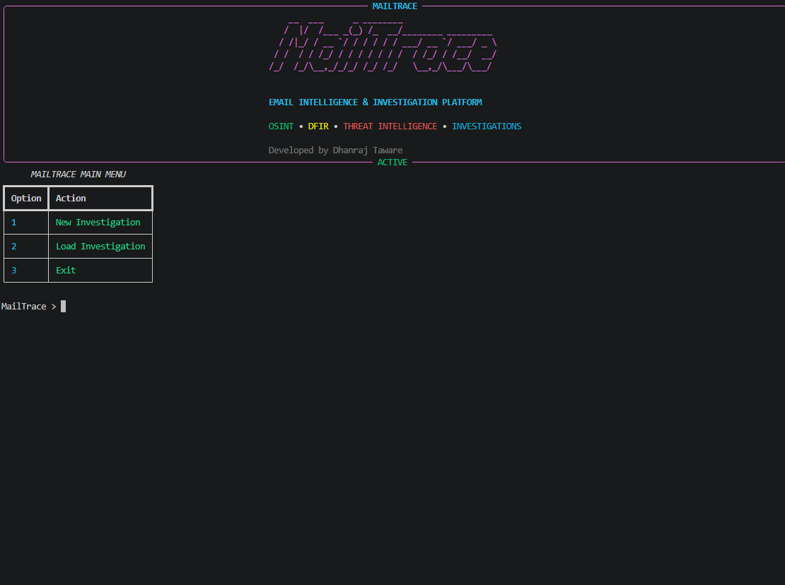
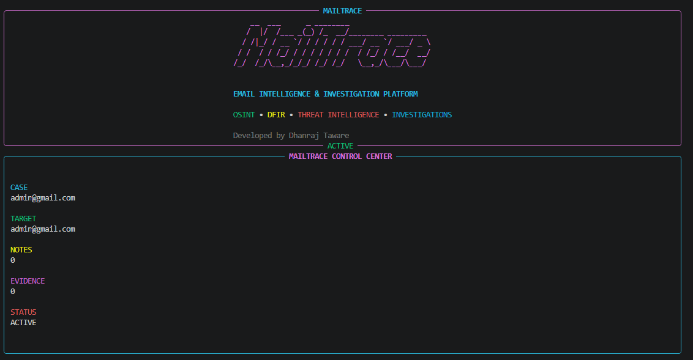
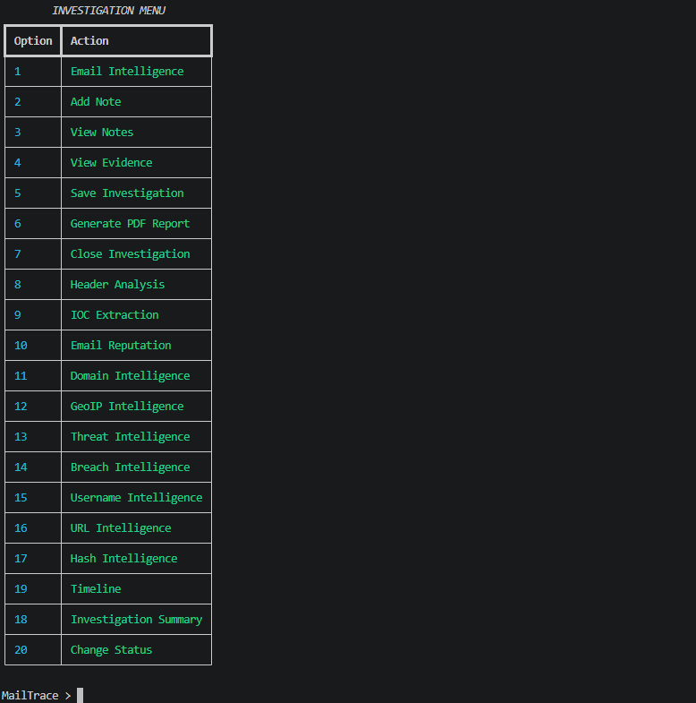

# MailTrace

<div align="center">

## Email Intelligence & Investigation Platform

OSINT • DFIR • Threat Intelligence • Digital Investigations

</div>

---

## Overview

MailTrace is a Python-based Email Intelligence and Investigation Platform designed for OSINT, DFIR, cybersecurity investigations, and digital evidence collection.

The platform enables analysts to perform email intelligence gathering, header analysis, IOC extraction, reputation checks, domain investigations, GeoIP analysis, and investigation management from a single interface.

---

## Features

### Email Intelligence

* MX Record Discovery
* SPF Detection
* DMARC Detection
* Email Provider Identification
* Risk Scoring

### Header Analysis

* SPF Validation
* DKIM Validation
* DMARC Validation
* Source IP Extraction
* Mail Route Analysis

### IOC Extraction

* Email Extraction
* IP Address Extraction
* Domain Extraction
* URL Extraction

### Email Reputation

* Risk Assessment
* Domain Classification
* Disposable Email Detection

### Domain Intelligence

* WHOIS Lookup
* Registrar Information
* Domain Age Analysis
* Nameserver Enumeration
* DNSSEC Detection

### GeoIP Intelligence

* Country Identification
* Region Detection
* City Information
* ISP Detection
* ASN Discovery
* Timezone Identification

### Username Intelligence

* GitHub Discovery
* Reddit Discovery
* TikTok Discovery
* Pinterest Discovery

### URL Intelligence

* URL Parsing
* Domain Extraction
* Parameter Analysis
* Suspicious Keyword Detection
* Risk Scoring

### Hash Intelligence

* MD5 Detection
* SHA1 Detection
* SHA256 Detection
* Hash Classification

### Breach Intelligence

* Breach Discovery
* Exposure Tracking

---

## Investigation Management

* Case Creation
* Investigation Dashboard
* Evidence Collection
* Evidence Viewer
* Notes Management
* Investigation Timeline
* Case Status Tracking
* Investigation Summary
* PDF Report Generation

---

## Screenshots

<p align="center">
  
  <br><br>

  
  <br><br>

  
  <br><br>
</p>

---

## Installation

Clone the repository:

```bash
git clone https://github.com/YOUR_USERNAME/MailTrace.git

cd MailTrace
```

Install dependencies:

```bash
pip install -r requirements.txt
```

Run MailTrace:

```bash
python main.py
```

---

## Project Structure

```text
MailTrace/

├── core/
│   ├── banner.py
│   ├── dashboard.py
│   ├── loading.py
│   ├── storage.py
│   ├── evidence_viewer.py
│   ├── timeline.py
│   ├── investigation_summary.py
│   ├── report_generator.py
│   └── utils.py
│
├── modules/
│   ├── email_lookup.py
│   ├── header_analyzer.py
│   ├── ioc_extractor.py
│   ├── email_reputation.py
│   ├── domain_intelligence.py
│   ├── geoip_lookup.py
│   ├── breach_lookup.py
│   ├── username_intelligence.py
│   ├── url_intelligence.py
│   └── hash_intelligence.py
│
├── investigations/
├── reports/
│
├── main.py
├── requirements.txt
├── README.md
└── LICENSE
```

---

## Example Workflow

1. Create a New Investigation
2. Run Email Intelligence
3. Analyze Email Headers
4. Extract Indicators of Compromise
5. Perform Domain Intelligence
6. Run GeoIP Analysis
7. Collect Evidence
8. Review Timeline
9. Generate Investigation Report

---

## Roadmap

### Version 1.1

* Threat Intelligence Integration
* VirusTotal Support
* AbuseIPDB Integration
* AlienVault OTX Support

### Version 1.2

* Advanced Breach Intelligence
* Multi-Target Investigations
* Automated IOC Correlation

### Version 2.0

* Web Dashboard
* Database Backend
* Multi-User Support
* API Integrations

---

## Technologies Used

* Python
* Rich
* DNSPython
* Python-WHOIS
* Requests
* IPWhois
* ReportLab

---

## License

This project is licensed under the MIT License.

---

## Author

**Dhanraj Taware**

Cybersecurity • OSINT • DFIR • Threat Intelligence

MailTrace v1.0
